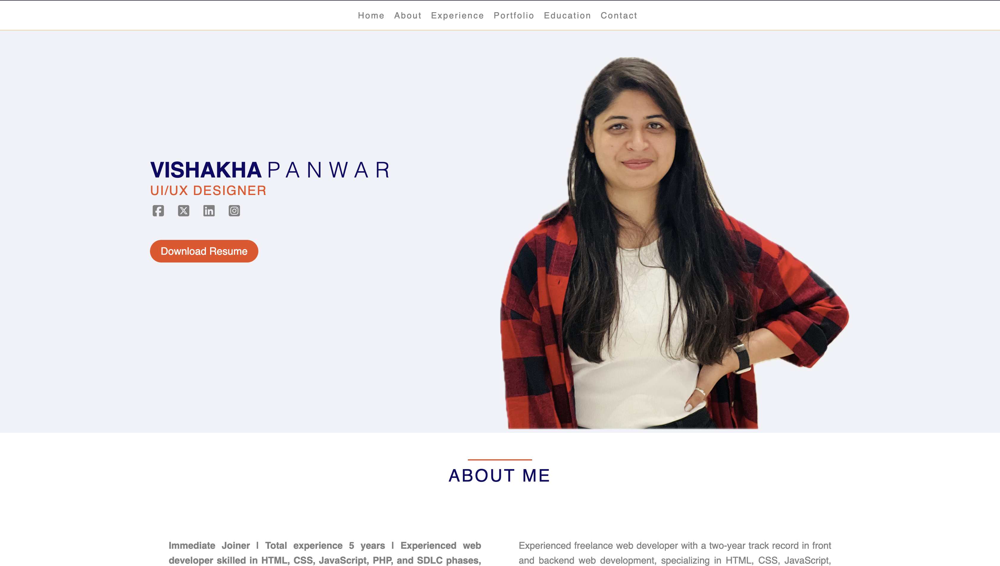

Portfolio README

Welcome to Vishakha's Portfolio!

This portfolio showcases my skills, projects, and experiences as a Freelancer Web Project.

## Table of Contents

1. About Me
2. Experience
3. Projects
4. Education
5. Contact Information

## 1. About Me

I am an enthusiastic web developer with two years of experience in the field. My journey into web development began right after college when I decided to pursue it as my career path.

## 2. Experience

- Customer Support Engineer - Wisetr Pvt. Ltd. | Full-time
  Used remote diagnostic tools to identify sources of certain customer issues. Promoted purchase of service contracts and warranties by detailing the benefits of each to customers. Took ownership of issues and set proper and realistic expectations to deliver prompt solutions. 2.5+ years of experience as a Support Engineer in IT and software industries. Proficient in troubleshooting hardware and software issues, including network configurations and system optimizations. Skilled in providing prompt and effective technical support to end-users and clients. Strong communication and interpersonal skills, with a commitment to delivering outstanding customer service.  

- Web Developer - CromulentPixel | Self-employed
  Knowledgeable Web Developer brings superior front- and back-end design to promote organization-specific website presence. Thoroughly comprehend complex HTML, CSS and JavaScript programming languages to generate custom webpage design. Extensive collaboration with Cromulent Pixels to ascertain company expectations and oversee site creation, from initial planning through rollout and support. Detail-oriented approach to maintaining website responsiveness, effectiveness and security.

## 3. Projects

### Project 1: [Just Gadgets]

Description: JustGadgets.in offers a diverse range of cutting-edge gadgets, from smartphones to smartwatches, providing tech enthusiasts with the latest innovations. With a user-friendly interface and seamless navigation, it's your one-stop destination for staying updated and discovering the most sought-after gadgets on the market.
Skills/Technologies Used: HTML | WordPress | CSS | Elementor
Link: https://www.justgadgets.in/

### Project 2: [Shivalik Holidays Trip]

Description: Shivalik Holidays Trip offers tailored travel experiences, blending adventure with luxury across breathtaking destinations. From serene beach getaways to exhilarating mountain escapades, our meticulously crafted packages cater to diverse travel preferences. With a commitment to exceptional service and unforgettable memories, embark on a journey of exploration and relaxation with the Shivalik Holidays Trip.
Skills/Technologies Used: HTML | CSS | JS | PHP
Link: https://shivalikholidaystrip.com/

### Project 3: [Abu FireBall]

Description: A fire fighting industry, striving to create safe, globally compliant technologies. Their latest innovation is an individual-friendly, eco-friendly fireball, offering efficient fire suppression. Pioneering in pyrotechnics, they now bring their expertise to enhance fire safety with cutting-edge solutions.
Skills/Technologies Used: HTML | CSS | JS | PHP
Link: https://abufire.mudraveda.com/

### Project 4: [JMMT Org]

Description: JMMT is dedicated to enhancing the lives of underprivileged children in rural Dehradun. Our mission is to offer these children a purposeful initiation into education, within a nurturing, supportive, and healthy setting that fosters distinctive learning opportunities.
Skills/Technologies Used: HTML | CSS | JS | PHP | WordPress
Link: https://jmmt.org.in/

### Project 5: [Canfield High School]

Description: Canfield School offers a dynamic educational experience, blending academic excellence with holistic development. Our innovative curriculum, dedicated faculty, and state-of-the-art facilities foster a nurturing environment where students thrive intellectually, emotionally, and socially. Join us on a journey of discovery and growth at Canfield School.
Skills/Technologies Used: HTML | CSS | JS | PHP
Link: https://canfieldschool.com/

### Project 6: [My PANKH Org]

Description: The website http://mypankh.org/ delves into India's rich tapestry of diversity, showcasing its myriad cultures, languages, and traditions. It emphasizes the importance of education as a cornerstone of humanity, addressing the limitations and inequalities present in educational systems globally, particularly in India. It advocates for a focus on holistic development beyond mere academic qualifications.
Skills/Technologies Used: HTML | CSS | JS | PHP
Link: http://mypankh.org/

### Project 7: [Aavrak Lab Test]

Description: A modern diagnostic centre login page offering streamlined access for efficient management and user convenience.
Skills/Technologies Used: HTML | CSS | JS | PHP
Link: http://mypankh.org/

### Project 8: [Alarm Clock]

Description: Alarm Clock is a simple and elegant web application that lets you set multiple alarms with custom time and description. You can also receive visual and audio notifications when the alarm goes off, and delete alarms that you don’t need anymore.
Skills/Technologies Used: HTML | CSS | JS
Link: https://vishakha161996.github.io/alarm-clock/

## 4. Education

## 5. Contact Information

Feel free to reach out to me via email at panwarvishakha31@gmail.com or connect with me on LinkedIn https://www.linkedin.com/in/vishakha-panwar-55a84114b/. I'm open to collaborations, job opportunities, or just a friendly chat!

Thank you for visiting my portfolio!